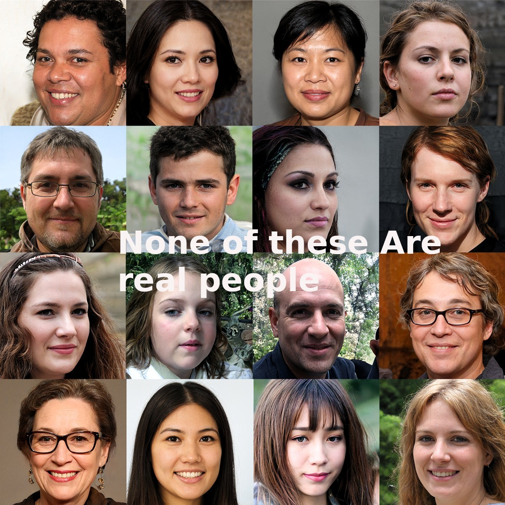
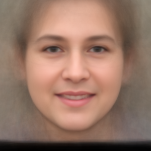
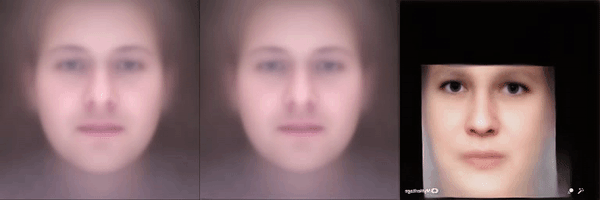
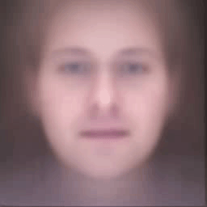
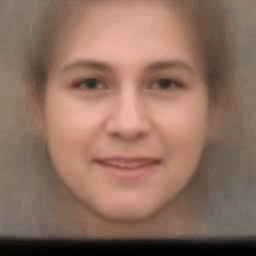

# Online_AI_Gallery    ??LOGO


***Online AI Gallery*** is a show that represents images that have been reshaped and edited through multiple Artificial intelligence frameworks in order to generate awesome artifacts.You can use this project, which is a compilation of multiple Artificial intelligence frameworks for image processing and can adapt, extend, overwrite, and customize anything to your needs


## Objectives:

1. Get around 300 fake images downloaded from a library called This Person doesnt not Exist API.
2. Find faces that might be duplicated.
3. Face Recognition. 
4. Composite all face to generate one average face.
5. Build a 3D modle of the average face.
6. Animate the average face in a way that will moves and talks according to a recorded video or real-time.
7. Cloning Voice to use it in our recorded video for presenation purposes.
8. Build different layouts for presentation.


:star: Star us on GitHub — it motivates us a lot!


# Table Of Content

- [Online_AI_Gallery    ??LOGO](#online_ai_gallery----logo)
  - [Objectives:](#objectives)
- [Table Of Content](#table-of-content)
- [Installation](#installation)
- [Images](#images)
    - [Download Fake Images](#download-fake-images)
    - [Composite Faces Library](#composite-faces-library)
    - [3D Face](#3d-face)
- [Voice](#voice)
    - [Voice Clone](#voice-clone)
    - [Voice Machine Generated](#voice-machine-generated)
    - [Song](#song)
- [Animate](#animate)
    - [Face Bobbling](#face-bobbling)
- [Gallery](#gallery)
- [Trouble Shooting](#trouble-shooting)
- [License](#license)
- [Want to Contribute?](#want-to-contribute)
- [Team](#team)


# Installation

First clone this repo then please follow each section's requirement to get your  results.

```
git clone https://github.com/karmelyoei/Online_AI_Gallery.git 
```


# Images

This section is about manipulating images. removing the faces from an image, removing any duplicate images, face recognition, combining all faces to form one average face, and animating this average face in real-time or recorded video.

### Download Fake Images
Compiste faces will be created by processing a series of photos, to obtain these photos, we will utilize a library called [This person does not exist API](https://pypi.org/project/thispersondoesnotexist/) to retrieve a large number of bogus images. Take the following actions:

1. Create a folder inside the src folder name it fake_images.
   
```p
mkdir -p src/data/fake_images
```

2. Download 300 images from the website through Running file getFakeFaces.py, you can customize the number of images instead of 300.
   
```p
python src/getFakeFaces.py  src/data/fake_images 300
```



### Composite Faces Library

After obtaining a slew of fake photographs from the first phase, we can use our face composite file to create an average face from these images. 

For the composite face, we go through three steps: first, we detect the facial feature, then we normalize the images to the same reference frame (600* 600), and last, we align the faces together.

We are using the dilb face recognition built with deep learning, For each facial image we calculate 68 facial landmarks using dlib.check out the Face dot map markup (what each dot represents) [here!](doc/face_dots_map.jpg).


Perform the following actions:

1. Download the shape predictor from this link [shape_predictor_68_face_landmarks.dat](https://github.com/davisking/dlib-models.) and save it under the folder name ```src/detectors/dots_detector/```
  
2. Create virual environment : ```pip install virtualenv```
   
3. Build virtual environment: ```virtualenv env```

4. Activate virtual environment <br />
For windows: ```env/Script/activate``` <br />
For Linux : ```source env/bin/activate ```

5. Install the requirements for this step: ```pip install dlib numpy opencv-python imutils```
   
6. Run this command to build the dot files for each image: ```python src/faceCreatePoints.py \ --dat src/detectors/dots_detector shape_predictor_68_face_landmarks.dat \
  --imagespath src/data/fake_images```

7. Run the faceComposite file:```python src/faceComposite.py --path src/data/fake_images```
8. You will find the results inside folder ```./src/data/fake_images/composite```
   
 <div style="text-align:center"></div>

### 3D Face 

Based on [3D Face Reconstruction from a Single Image library](https://github.com/AaronJackson/vrn) we used the [demo](https://vrn.aaronsplace.co.uk/index.php) of this library. more info you can read the [project website](https://aaronsplace.co.uk/papers/jackson2017recon/)

Coming soon ....


# Voice
Instead of using our voices, we will use various methods to clone them, convert text to speech, or generate songs for video recording.


### Voice Clone
Using [Google Colab](https://colab.research.google.com/drive/1qF4hjMsFPl-fLFhy3q0q5LLSgksNhIvT?usp=sharing) for Cloning voice.

Please Note : Before run all the commands on the Google colab, prepare an audio of your voice upload it to the colab, change the file name "trump10.wav" to your audio file name & change the text in the 6th cell to the text you wanted the voice to say it.


### Voice Machine Generated
Coming Soon!

### Song
Coming Soon!


# Animate 

### Face Bobbling

Thanks to [Real_Time_Image_Animation](https://github.com/anandpawara/Real_Time_Image_Animation), we built our bobbling face inside an image.Follow these steps to create your own!


1. Create virual environment : ```pip install virtualenv```
   
2. Build virtual environment: ```virtualenv env```

3. Activate virtual environment <br />
For windows: ```env/Script/activate``` <br />
For Linux : ```source env/bin/activate ```

4. Install the requirements by running this command:
   ```pip install -r src/requirements/headbobble_requirements.txt ```

5. download the training module ```vox-adv-cpk.pth.tar``` from this 
   [link1](https://openavatarify.s3.amazonaws.com/weights/vox-adv-cpk.pth.tar)  or
   [link2](https://yadi.sk/d/M0FWpz2ExBfgAA) or  
   [link3](https://yadi.sk/d/M0FWpz2ExBfgAA).
   or you can download it through this command. then save it under folder called src/checkpoints

   ```
   curl https://openavatarify.s3.amazonaws.com/weights/vox-adv-cpk.pth.tar \
     --output src/checkpoints/vox-adv-cpk.pth.tar```

6. Prepare a recorded video of yourself with slow-motion you can use an application like cheese on your Linux or other application for recording videos.
   
7. Run these commands:
      ``` cd src/Real_Time_Image_Animation```
     ```
     python headbobble_image_animation.py \
     --checkpoint ../checkpoints/vox-adv-cpk.pth.tar \
    --input_image ../../doc/face_composite.png  \
    --input_video ../../doc/face_headbobble_1_source.mp4```
  

8. You can use your webcam instead of recorded video by running this command:
  
  ```
   python image_animation.py \
  --checkpoint ../checkpoints/vox-adv-cpk.pth.tar \
  --input_image ../../doc/face_composite.png
  ```

9. You will find the results in output folder.

Comparison of myheritage and local techniques, which shows where local technique has issues:



We can compensate for those issues by limiting the head movements:

  
  


---

***Note***: If results does not show your webcam frame you may need to manually edit the X,Y offesets at line 67. To get the size of your webcam using [testWebcam.py](src/testWebcam.py) and examine the output image in a image editor to figure out a X,Y offset that should be used in the image_animation code. 

Above uses Real_Time_Image_Animation library with modifications. To rebuild Real_Time_Image_Animation from scratch:
```
git clone \
    https://github.com/anandpawara/Real_Time_Image_Animation \
    faces/Real_Time_Image_Animation

// Modify code to use CPU and create destination output file
cp headbobble_image_animation.py faces/Real_Time_Image_Animation/.

```

### Lip sync

Used LipSunc library through [Google Colab](https://colab.research.google.com/drive/10Z7HFUUGtJVFcabjXf6BUUOJUlC0ME7i#scrollTo=jR5utmDMcSZY) or using [Wav2Lip library](https://github.com/Rudrabha/Wav2Lip).


Follow these steps for Using ***GoogleColab***:
1. In your google Drive create two folders names "Wav2Lip" / "Wav2lip".
2. Save the images and the aduio files in "Wav2Lip" folder.
3. Save the training module Wav2lip + Gan in "Wav2lip" folder.

To dowlond the training module click [here!.](https://iiitaphyd-my.sharepoint.com/personal/radrabha_m_research_iiit_ac_in/_layouts/15/onedrive.aspx?id=%2Fpersonal%2Fradrabha%5Fm%5Fresearch%5Fiiit%5Fac%5Fin%2FDocuments%2FWav2Lip%5FModels%2Fwav2lip%5Fgan%2Epth&parent=%2Fpersonal%2Fradrabha%5Fm%5Fresearch%5Fiiit%5Fac%5Fin%2FDocuments%2FWav2Lip%5FModels&originalPath=aHR0cHM6Ly9paWl0YXBoeWQtbXkuc2hhcmVwb2ludC5jb20vOnU6L2cvcGVyc29uYWwvcmFkcmFiaGFfbV9yZXNlYXJjaF9paWl0X2FjX2luL0Vkakk3YlpsZ0FwTXFzVm9FVVVYcExzQnhxWGJuNXo4VlRtb3hwNTVZTkRjSUE%5FcnRpbWU9M3dYYk9ZUVEyVWc)

Then run the commands in the google colab by giving the code the authorization's code for your google drive to give it access to the folders.


Follow these steps for Using ***Wave2Lib locally***:

```
 git clone https://github.com/Rudrabha/Wav2Lip
 sudo apt-get install ffmpeg
 pip install librosa tqdm==4.45.0 numba opencv-contrib-python
 *** or pip install -r requirements.txt***
 mkdir -p detectors/face_detector
 curl https://www.adrianbulat.com/downloads/python-fan/s3fd-619a316812.pth \
  --output detectors/face_detector/s3fd.pth

 cd voices/Wav2Lip

 python inference.py \
   --checkpoint_path ../weights/wav2lip_gan.pth \
   --face "../../documentation/face_headbobble_3_destination.avi" \
   --audio "../../documentation/voice_gallium_20sec.mp3"
 
  ***If result appears to lack audio***:
 ffmpeg -i temp/result.avi -i temp/temp.wav -c:v copy -c:a aac temp/result_combined.avi

```
the results will appear in temp/ folder.

[  ](./doc/animate_lipsync_gallium.mp4) 
[  ](./doc/animate_lipsync2_gallium.mp4)

Result video including audio [here](./doc/animate_lipsync_gallium.mp4) and [here](./doc/animate_lipsync2_gallium.mp4)


# Gallery 

Different layouts for our online Gallery.
Coming Soon...!


# Trouble Shooting

# License
[MIT](https://tldrlegal.com/license/mit-license)

[nanocomponent]: https://github.com/choojs/nanocomponent
[nanolru]: https://github.com/s3ththompson/nanolru
[bankai]: https://github.com/choojs/bankai
[nanohtml]: https://github.com/choojs/nanohtml
[browserify]: https://github.com/substack/node-browserify
[budo]: https://github.com/mattdesl/budo
[es2020]: https://github.com/yoshuawuyts/es2020
[handbook]: https://github.com/yoshuawuyts/choo-handbook
[hyperx]: https://github.com/substack/hyperx
[morphdom-bench]: https://github.com/patrick-steele-idem/morphdom#benchmarks
[nanomorph]: https://github.com/choojs/nanomorph
[nanorouter]: https://github.com/choojs/nanorouter
[yo-yo]: https://github.com/maxogden/yo-yo
[unassertify]: https://github.com/unassert-js/unassertify
[window-performance]: https://developer.mozilla.org/en-US/docs/Web/API/Performance

# Want to Contribute?
Please take a look at our contributing guidelines if you're interested in helping!


# Team

Want to say Hi or buy us a coffee send us a PM! or donate here for us Thanks!.:sunglasses: :two_hearts:

<div>
<a href="https://github.com/karmelyoei" target="_blank" ></a>
<a href="https://github.com/cyphunk"  target="_blank"></a>
</div>